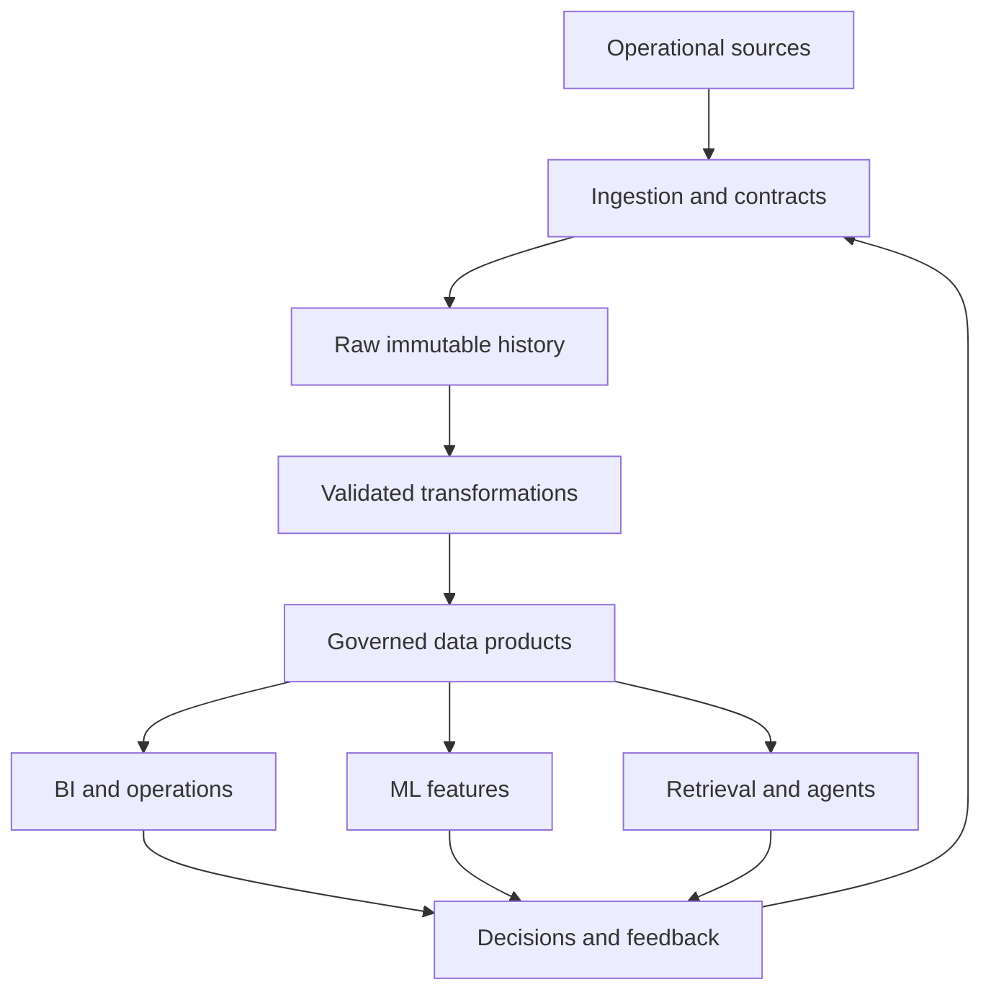

# AI-Era Data Engineering

AI changes how data systems are built, but it does not remove the need for Data Engineering. It raises the value of trustworthy context, evaluation, governance, and operational judgment.

## What Becomes More Valuable

| Durable capability | Why it matters in the AI age |
| --- | --- |
| Problem framing | Fast code generation is wasted when the decision or user need is wrong |
| Data semantics | Models cannot reliably infer what fields, grains, states, and metrics mean in a business |
| Contracts and interfaces | Humans, pipelines, BI, agents, and models need stable expectations |
| Quality and evaluation | Plausible output is not evidence of correctness |
| System design | Latency, reliability, cost, privacy, and complexity remain tradeoffs |
| Operations | Generated systems still fail, drift, duplicate data, leak secrets, and need recovery |
| Governance | AI increases the number of ways sensitive or misleading data can be exposed |
| Communication | Engineers must connect technical evidence to decisions and risk |

Tool syntax will increasingly be assisted. Judgment, ownership, and verification remain the profession.

## A Reference Architecture

The important idea is not a specific vendor. Analytics and AI should consume governed products with shared definitions, lineage, access rules, and quality evidence. Feedback must return as data that can be evaluated.

## The AI-Ready Data Product Contract

For every dataset exposed to a model, retrieval system, or agent, document:

- owner and intended users;
- approved purpose and prohibited uses;
- entity, grain, keys, and time semantics;
- source lineage and refresh expectation;
- quality rules and known blind spots;
- sensitive fields, access policy, and retention;
- versioning and change policy;
- evaluation set and acceptance thresholds;
- feedback capture and rollback procedure; and
- cost, latency, and availability expectations.

## Use AI as an Engineering Assistant

Good uses include generating test cases, explaining unfamiliar code, proposing SQL alternatives, creating synthetic edge cases, drafting documentation, and accelerating incident hypotheses.

Never treat generated code or answers as verified. For each material AI contribution:

1. State the intended behavior and constraints before generation.
2. Review data access, secrets, destructive operations, and dependency choices.
3. Test with normal, boundary, malformed, duplicate, late, and missing data.
4. Compare important calculations with an independent query or fixture.
5. Record limitations and keep a human owner for release decisions.

## Skills to Learn Deeply

Prioritize these in order:

1. SQL, relational thinking, data grain, and business metrics.
2. Python and software engineering for reliable automation.
3. Data modeling, contracts, testing, lineage, and observability.
4. Batch architecture, incremental processing, idempotency, and orchestration.
5. Security, privacy, cost, incident response, and stakeholder communication.
6. Cloud, distributed, and streaming systems when scale or latency justifies them.
7. AI data interfaces: semantic layers, document pipelines, retrieval, evaluation, and feedback loops.

## Architecture Decision Test

Before adding Spark, Kafka, a vector database, an agent, or another platform, answer:

- What measurable constraint does the simpler design fail?
- What volume, latency, concurrency, or recovery target must be met?
- Who will operate the added component?
- How will it be tested, observed, secured, and paid for?
- What is the exit or rollback plan?

If these answers are unclear, build the smaller system and measure first. Future-proof engineering means preserving options and mastering principles—not accumulating tools.
