# Data Engineering From Zero To Impact

## Build reliable data systems from fundamentals to real business impact

Data Engineering is not just about learning tools. It is the practice of turning raw, unreliable, scattered data into trusted systems that support decisions, operations, analytics, automation, and AI.

This repository is a practical roadmap, knowledge base, project lab, and portfolio system for learners who want to grow from beginner level to professional Data Engineering capability.

> Tools change. Fundamentals remain.

## What You Will Build

By following this repo, you will learn how to build data systems that look like real work:

| Area | What You Build |
| --- | --- |
| SQL and databases | Retail schemas, sales analysis, joins, windows, indexes, and validation queries |
| Python pipelines | CSV/API extractors, cleaning logic, logging, error handling, tests, and PostgreSQL loads |
| Data modeling | Relational models, star schemas, facts, dimensions, metrics, and marts |
| Production habits | Environment config, Docker Compose, data quality checks, retries, docs, and runbooks |
| Portfolio projects | Beginner, intermediate, advanced, and capstone projects with business impact |
| AI-ready data | RAG ingestion, document processing, vector database concepts, governed AI data access |

## Learning System At A Glance

```mermaid
flowchart LR
    A[Fundamentals] --> B[SQL + Python]
    B --> C[Data Modeling]
    C --> D[ETL/ELT Pipelines]
    D --> E[Warehousing + dbt]
    E --> F[Quality + Observability]
    F --> G[Cloud + Production]
    G --> H[Streaming + Big Data]
    H --> I[AI-Ready Data]
    I --> J[Portfolio + Career]
```

## Start Here

If you are new to the repository, use this order:

1. Read [00-introduction/README.md](00-introduction/README.md) to understand what Data Engineering is and how this repo is organized.
2. Read [ROADMAP.md](ROADMAP.md) to see the full beginner-to-professional path.
3. Study [01-fundamentals/](01-fundamentals/) and [02-sql-and-databases/](02-sql-and-databases/) before jumping into advanced tools.
4. Build one beginner project from [17-projects/beginner/](17-projects/beginner/).
5. Use [18-templates/](18-templates/) to document your work professionally.
6. When you finish a project, improve it with data quality, production notes, and business impact.

Do not measure progress by pages read. Use the [Learning and Evidence System](LEARNING-SYSTEM.md) to produce one verifiable artifact every week, and use the [Business Impact Scorecard](18-templates/business-impact-scorecard.md) before calling a project complete.

Recommended first project: [17-projects/beginner/04-retail-sales-pipeline/](17-projects/beginner/04-retail-sales-pipeline/).

## The Core Learning Loop

Every module and project should move through the same professional loop:

1. **Frame** — identify the user, decision, pain, constraints, and measurable outcome.
2. **Build** — create the smallest end-to-end data flow that produces a useful output.
3. **Verify** — test correctness, freshness, completeness, security, and rerun behavior.
4. **Operate** — observe a run, investigate a failure, backfill safely, and write a runbook.
5. **Explain** — communicate architecture, tradeoffs, cost, limitations, and business value.
6. **Improve** — use evidence and feedback to choose the next change.

This loop is deliberately tool-independent. It is the durable skill behind SQL, Python, dbt, Airflow, Spark, Kafka, cloud platforms, and AI systems.

## AI-Age Positioning

AI can generate SQL and pipeline code. The durable value of a Data Engineer is therefore moving upward: framing the right problem, understanding source semantics, designing trustworthy interfaces, evaluating outputs, operating systems, governing access, and making sound tradeoffs.

Use [AI-Era Data Engineering](AI-ERA-DATA-ENGINEERING.md) for the future-proof capability model, reference architecture, and rules for using AI without outsourcing judgment.

## Choose Your Path

| If you are... | Start with | Then build |
| --- | --- | --- |
| New to data engineering | [00-introduction/](00-introduction/) and [01-fundamentals/](01-fundamentals/) | [CSV To PostgreSQL](17-projects/beginner/01-csv-to-postgres/) |
| Comfortable with spreadsheets or BI | [02-sql-and-databases/](02-sql-and-databases/) and [04-data-modeling/](04-data-modeling/) | [SQL Sales Analysis](17-projects/beginner/03-sql-sales-analysis/) |
| Learning Python automation | [03-python-for-data-engineering/](03-python-for-data-engineering/) and [05-etl-elt-pipelines/](05-etl-elt-pipelines/) | [Retail Sales Pipeline](17-projects/beginner/04-retail-sales-pipeline/) |
| Preparing for portfolio projects | [17-projects/](17-projects/) and [18-templates/](18-templates/) | [Retail Sales Warehouse](17-projects/intermediate/02-retail-sales-warehouse/) |
| Exploring AI-ready data | [15-ai-ready-data-engineering/](15-ai-ready-data-engineering/) | [AI-Ready Data Platform](17-projects/advanced/05-ai-ready-data-platform/) |

## Repository Guide

| Section | Purpose |
| --- | --- |
| [00-introduction/](00-introduction/) | Start here: roles, modern data stack, and how to use the repo |
| [01-fundamentals/](01-fundamentals/) | Command line, Git, APIs, files, Docker, and computing basics |
| [02-sql-and-databases/](02-sql-and-databases/) | SQL, joins, windows, indexes, transactions, and PostgreSQL practice |
| [03-python-for-data-engineering/](03-python-for-data-engineering/) | Python for files, APIs, pipelines, logging, testing, and database loads |
| [04-data-modeling/](04-data-modeling/) | Relational models, dimensional models, facts, dimensions, and metrics |
| [05-etl-elt-pipelines/](05-etl-elt-pipelines/) | ETL/ELT, batch, incremental loading, idempotency, validation, and patterns |
| [06-data-warehousing/](06-data-warehousing/) | Warehouse concepts, marts, partitioning, BigQuery, Snowflake, and Redshift |
| [07-data-lake-and-lakehouse/](07-data-lake-and-lakehouse/) | Data lakes, Bronze/Silver/Gold, Parquet, Delta Lake, and Iceberg |
| [08-orchestration/](08-orchestration/) | Airflow, DAGs, scheduling, backfills, retries, alerts, and monitoring |
| [09-dbt-and-analytics-engineering/](09-dbt-and-analytics-engineering/) | dbt models, tests, docs, sources, seeds, and analytics engineering |
| [10-big-data-processing/](10-big-data-processing/) | Distributed computing, Spark, PySpark, optimization, partitions, and shuffling |
| [11-streaming-data/](11-streaming-data/) | Kafka, streaming concepts, event time, late data, and checkpoints |
| [12-data-quality-testing-observability/](12-data-quality-testing-observability/) | Validation, quality tools, monitoring, alerting, and observability |
| [13-cloud-data-engineering/](13-cloud-data-engineering/) | Cloud fundamentals, AWS, GCP, Azure, IAM, networking, and cost |
| [14-production-engineering/](14-production-engineering/) | Deployment, CI/CD, secrets, logging, alerting, and production readiness |
| [15-ai-ready-data-engineering/](15-ai-ready-data-engineering/) | Feature pipelines, RAG, vector databases, documents, agents, and governance |
| [16-business-use-cases/](16-business-use-cases/) | Retail, inventory, customer analytics, finance, ecommerce, logistics, and SMEs |
| [17-projects/](17-projects/) | Project labs from beginner to capstone |
| [18-templates/](18-templates/) | Reusable README, architecture, pipeline, dbt, Docker, and checklist templates |
| [19-interview-and-career/](19-interview-and-career/) | Career roadmap, interviews, system design, portfolio, resume, and role levels |
| [20-real-world-case-studies/](20-real-world-case-studies/) | Business-focused case studies that connect systems to impact |
| [resources/](resources/) | Books, courses, official docs, tools, datasets, and communities |

## Project Tracks

| Level | Track | What It Proves |
| --- | --- | --- |
| Beginner | [17-projects/beginner/](17-projects/beginner/) | You can load, query, clean, validate, and document simple business data |
| Intermediate | [17-projects/intermediate/](17-projects/intermediate/) | You can design portfolio-grade ETL, warehouse, dbt, inventory, and Airflow projects |
| Advanced | [17-projects/advanced/](17-projects/advanced/) | You can reason about lakehouse, Spark, Kafka, cloud warehouse, and AI-ready architecture |
| Capstone | [17-projects/capstone/](17-projects/capstone/) | You can present complete systems with business impact, governance, cost, and scale |

## What Makes This Different

This is not a list of random tutorials. It is built as a practical learning system:

| Principle | How It Shows Up |
| --- | --- |
| Fundamentals first | SQL, Python, files, APIs, modeling, and quality come before tool specialization |
| Business context | Examples focus on retail, inventory, ecommerce, SMEs, customer analytics, and operations |
| Production habits | Projects include setup, validation, logging, documentation, quality checks, and tradeoffs |
| Portfolio thinking | Each project is designed to explain a business problem, architecture, data model, and impact |
| Modern readiness | The roadmap includes cloud, orchestration, dbt, Spark, Kafka, observability, and AI-ready data |

## Mission

The mission of this repository is to help learners build practical Data Engineering skill from first principles to real-world impact.

It combines:

- A staged roadmap from beginner to advanced
- Clear explanations of core concepts
- Hands-on project labs based on realistic business scenarios
- Production-oriented habits around reliability, data quality, documentation, and monitoring
- Portfolio guidance for job readiness
- AI-ready Data Engineering practices for modern analytics, automation, and intelligent systems

The goal is not to memorize a stack. The goal is to understand how data systems work, why they fail, how to design them responsibly, and how to use them to solve business problems.

## Who This Is For

This repository is for:

- Beginners who want a clear path into Data Engineering
- Analysts who want to move from dashboards into pipelines, warehouses, and platforms
- Software developers who want to work with data infrastructure and analytics systems
- Students building a practical portfolio for internships or junior roles
- Self-taught learners who need structure instead of random tutorials
- Small business operators and technical founders who want better data systems
- AI builders who need reliable, well-modeled, governed data before applying machine learning or large language models

You do not need to know every tool before starting. You should be willing to practice SQL, Python, command-line basics, data modeling, debugging, and documentation.

## Learning Philosophy

### 1. Fundamentals before tools

Tools are useful, but they are not the foundation. This roadmap prioritizes concepts such as files, databases, schemas, data types, batch processing, APIs, orchestration, modeling, quality checks, and system tradeoffs before deep tool specialization.

### 2. Business problems before random tutorials

Every serious project should answer a business question or improve an operational workflow. Examples include inventory tracking, sales reporting, customer segmentation, supplier performance, demand forecasting, financial reconciliation, and business health monitoring.

### 3. Production thinking from the beginning

Even beginner projects should include naming conventions, reproducible setup, error handling, validation, documentation, and clear assumptions. Production thinking is a habit, not a final-stage topic.

### 4. Projects before theory-only learning

Theory matters, but Data Engineering is learned by building. This repository treats projects as the main learning unit. Concepts should be applied to pipelines, datasets, warehouses, dashboards, data contracts, and operational use cases.

### 5. Data quality, reliability, and trust

A pipeline that runs is not enough. Data must be accurate, complete, timely, consistent, observable, and explainable. Trust is one of the main outputs of Data Engineering.

### 6. AI-ready Data Engineering

AI systems depend on useful, reliable, well-structured data. This roadmap includes the foundations needed for AI-ready data platforms: clean datasets, metadata, lineage, governance, semantic layers, feature preparation, vector-ready content, and evaluation-oriented thinking.

### 7. Real-world business impact

The strongest projects connect engineering work to measurable outcomes: fewer manual reports, faster decisions, cleaner inventory records, better customer insights, improved forecasting, stronger compliance, and more reliable business operations.

## Roadmap Summary

The full roadmap is maintained in [ROADMAP.md](ROADMAP.md). At a high level, the learning journey moves through these stages:

1. **Stage 0: Orientation and Environment**  
   Understand what Data Engineering is, set up your local workspace, learn basic terminal usage, Git, documentation, and reproducible project structure.

2. **Stage 1: Data Foundations**  
   Learn files, tables, data types, schemas, CSV, JSON, Excel, relational thinking, basic statistics, and how business data is created.

3. **Stage 2: SQL and Databases**  
   Build strong SQL skill, understand relational databases, joins, aggregation, indexing basics, transactions, constraints, and data modeling.

4. **Stage 3: Python for Data Engineering**  
   Use Python for file processing, APIs, validation, automation, data cleaning, testing, and small pipeline development.

5. **Stage 4: Pipelines and Orchestration**  
   Build repeatable batch pipelines, schedule jobs, manage dependencies, handle failures, and document pipeline behavior.

6. **Stage 5: Warehousing and Analytics Engineering**  
   Learn dimensional modeling, warehouse design, dbt-style transformations, metrics, semantic consistency, and analytics-ready datasets.

7. **Stage 6: Data Quality, Observability, and Governance**  
   Add checks, alerts, lineage, contracts, access control, privacy awareness, and operational monitoring.

8. **Stage 7: Cloud and Modern Data Platforms**  
   Learn cloud storage, managed databases, warehouses, compute, deployment, infrastructure basics, and cost-aware architecture.

9. **Stage 8: Streaming and Real-Time Systems**  
   Understand events, queues, streams, latency, ordering, idempotency, and real-time operational use cases.

10. **Stage 9: AI-Ready Data Engineering**  
    Prepare trusted data for machine learning, analytics agents, retrieval systems, feature stores, vector search, and evaluation workflows.

11. **Stage 10: Professional Practice and Portfolio**  
    Build complete projects, write case studies, prepare interviews, explain tradeoffs, and show measurable business impact.

## Learning Paths

Different learners can use the roadmap in different ways.

### Beginner Path

Best for learners with little programming or database experience.

Recommended focus:

- Stage 0: Orientation and Environment
- Stage 1: Data Foundations
- Stage 2: SQL and Databases
- Stage 3: Python for Data Engineering
- One small business project using CSV, SQL, and Python

Goal: become comfortable handling structured data, querying databases, and building simple repeatable workflows.

### Analyst to Data Engineer Path

Best for spreadsheet, BI, or reporting professionals.

Recommended focus:

- Strong SQL review
- Data modeling and warehouse design
- Python automation
- dbt-style transformation thinking
- Data quality checks
- Dashboard-to-pipeline migration projects

Goal: move from manual reporting to reliable, documented, automated data systems.

### Developer to Data Engineer Path

Best for software engineers or backend developers.

Recommended focus:

- Data modeling
- Batch and streaming pipeline design
- Orchestration
- Warehouses and lakehouse patterns
- Data quality and observability
- Cloud deployment and infrastructure

Goal: apply software engineering habits to data-intensive systems.

### SME Business Data Path

Best for learners who want to solve practical business operations problems.

Recommended focus:

- Sales, inventory, customers, finance, and operations datasets
- Data cleaning and reconciliation
- KPI modeling
- Small warehouse design
- Automated reports
- Data quality rules for operational trust

Goal: build systems that help small and medium-sized businesses make better decisions with less manual work.

### AI-Ready Data Path

Best for learners interested in AI applications, machine learning support, or data products.

Recommended focus:

- Reliable source data
- Clean transformation layers
- Metadata and documentation
- Feature preparation
- Text and document processing
- Vector-ready datasets
- Evaluation datasets and feedback loops

Goal: prepare data that AI systems can use responsibly and effectively.

## Featured Projects

The project lab is organized around business problems that a learner can explain in interviews and portfolio reviews.

| Project | Business Question | Core Skills |
| --- | --- | --- |
| [Retail Sales Pipeline](17-projects/beginner/04-retail-sales-pipeline/) | Are sales, margin, customer, and inventory records clean enough for decision-making? | CSV ingestion, pandas, PostgreSQL, SQL transformations, tests, quality checks |
| [Retail Sales Warehouse](17-projects/intermediate/02-retail-sales-warehouse/) | Which products, categories, and customers drive revenue and profit? | Dimensional modeling, warehouse layers, marts, KPI design |
| [Inventory Reorder Pipeline](17-projects/intermediate/03-inventory-reorder-pipeline/) | What should the business reorder before stockouts hurt sales? | Inventory metrics, reorder logic, exception reporting, data validation |
| [Lakehouse Bronze/Silver/Gold](17-projects/advanced/01-lakehouse-bronze-silver-gold/) | How should large raw data be cleaned and promoted into trusted business layers? | Data lake architecture, Parquet, partitioning, governance, scalable processing |
| [Kafka Sales Events Pipeline](17-projects/advanced/03-kafka-streaming-sales-events/) | How can a business monitor sales events in near real time? | Events, topics, consumers, offsets, stream processing, alerts |
| [AI Business Analytics Assistant](17-projects/capstone/ai-business-analytics-assistant/) | How can leaders ask business questions safely using governed data and AI? | Semantic layer, data API, access control, AI-ready data, business answers |

## How To Use This Repo

1. Start with the roadmap.
   Read [ROADMAP.md](ROADMAP.md) to understand the stages and expected progression.

2. Pick your path.
   Choose the learning path that matches your background. Do not try to learn every tool at once.

3. Build projects as you learn.
   For each stage, create or complete a small project that proves the concept. A project should include code, data assumptions, documentation, and a short business explanation.

4. Keep a learning log.
   Record what you learned, what broke, how you debugged it, and what tradeoffs you made. This becomes useful interview material.

5. Treat documentation as part of the work.
   A pipeline is not complete until another person can understand what it does, how to run it, what data it expects, and how to validate the output.

6. Improve projects in layers.
   Start simple. Then add tests, validation, scheduling, monitoring, warehouse modeling, deployment, and cost awareness.

7. Build a portfolio narrative.
   For each completed project, explain the business problem, source data, architecture, data model, quality checks, tradeoffs, and impact.

## Repository Status

This repository is in its foundation stage. The first goal is to establish the structure, roadmap, contribution standards, and documentation principles. Project labs, examples, datasets, templates, and exercises will be added incrementally.

## License

This project is released under the terms described in [LICENSE](LICENSE).
